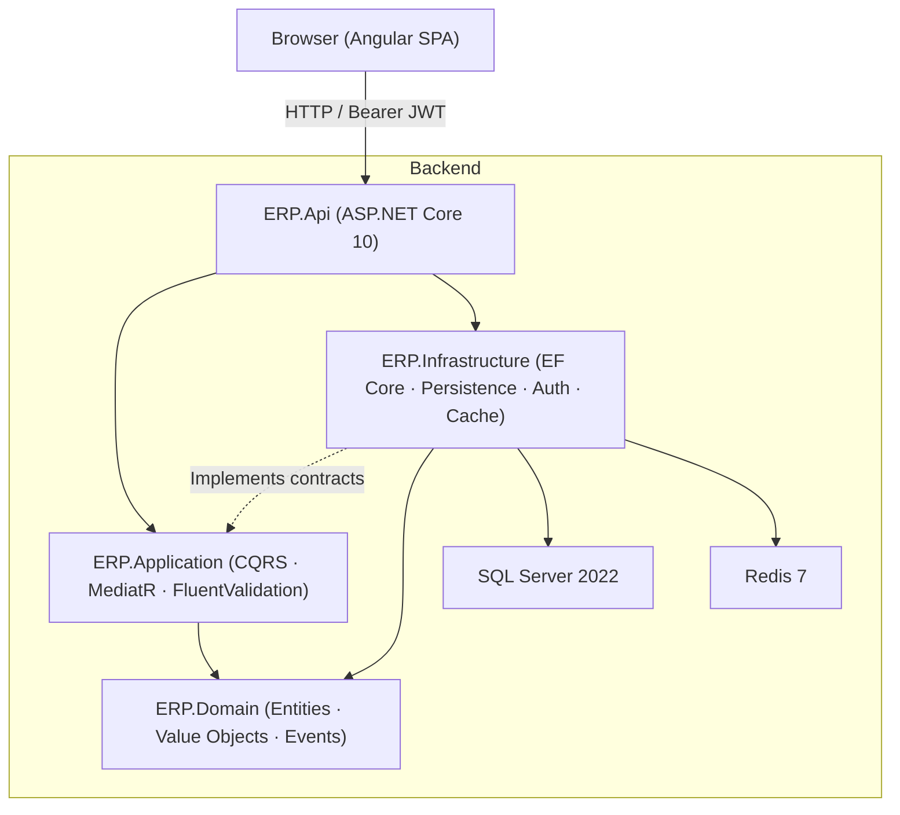
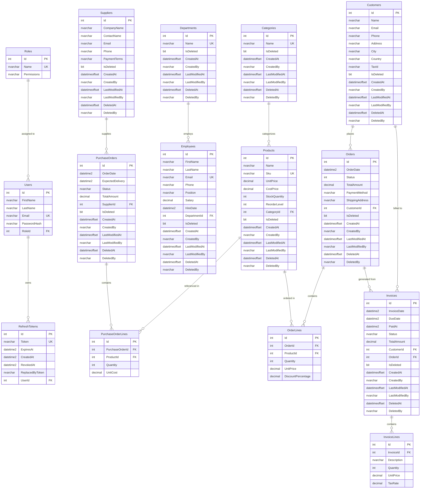

# ERP Management System

A full-stack Enterprise Resource Planning (ERP) web application featuring a .NET 10 REST API backend and an Angular 22 single-page application frontend.

---

## Overview

The system is a modular ERP platform covering Sales, Purchasing, Catalog & Inventory, Human Resources, Finance, and Identity & Access Management. It provides a RESTful API backend consumed by an Angular administrative SPA.

---

## Architecture

The backend follows **Clean Architecture** with **CQRS** (via MediatR) and feature-based organization. The frontend is a standalone Angular SPA using lazy-loaded routes.



### Dependency Flow

- **`ERP.Api`** $\rightarrow$ `ERP.Application` & `ERP.Infrastructure`
- **`ERP.Infrastructure`** $\rightarrow$ `ERP.Application` & `ERP.Domain` (implements data access, caching, auth, and repository abstractions)
- **`ERP.Application`** $\rightarrow$ `ERP.Domain` (contains commands, queries, handlers, and validation rules)
- **`ERP.Domain`** has no external project dependencies.

---

## Technology Stack

- **Backend:** .NET 10 / ASP.NET Core Web API, Entity Framework Core 10 (SQL Server), MediatR, FluentValidation, JWT Bearer authentication, BCrypt.Net-Next, QuestPDF (invoice exports), Serilog, Swashbuckle (Swagger UI).
- **Frontend:** Angular 22 (Standalone Components model), Angular Material & CDK, TypeScript, RxJS, Vitest.
- **Infrastructure & Data:** SQL Server 2022, Redis 7 (via `Microsoft.Extensions.Caching.StackExchangeRedis`), Nginx (Alpine container runtime), Docker & Docker Compose.

*(Detailed dependency versions are defined in `.csproj` and `package.json` files).*

---

## Project Structure

```
ERP-Management-System/
├── backend/
│   ├── ERP.Api/                    # ASP.NET Core Web API (Controllers, Program.cs, config)
│   ├── ERP.Application/            # CQRS layer (Features, Behaviors, Abstractions)
│   ├── ERP.Domain/                 # Core domain entities, value objects, and domain events
│   ├── ERP.Infrastructure/         # EF Core persistence, Repositories, Caching, Auth
│   └── ERP.Domain.Tests/           # Unit test suite (xUnit v3)
├── frontend/
│   ├── src/
│   │   ├── app/                    # Root configuration and routing
│   │   ├── core/                   # Auth service, API client, guards, interceptors
│   │   ├── features/               # Lazily loaded feature areas
│   │   ├── layout/                 # Shell layout, sidebar, header, auth containers
│   │   ├── shared/                 # Reusable UI components and models
│   │   └── environments/           # Client configuration (API endpoints)
│   ├── nginx.conf                  # Nginx reverse proxy / SPA static file server
│   └── Dockerfile                  # Multi-stage container build (Node -> Nginx)
├── docker-compose.yml              # Local multi-container orchestration
└── .env.example                    # Environment variable template
```

---

## Entity Relationship Diagram

The following diagram represents the current ERP database schema and its relationships as defined by the Entity Framework Core persistence model.



---

## Backend

- **CQRS & Pipeline Behaviors:** Requests dispatched through MediatR pass through:
  1. `LoggingBehavior` — logs request lifecycle and exceptions.
  2. `PerformanceBehavior` — logs warnings for requests exceeding 500 ms.
  3. `ValidationBehavior` — executes FluentValidation rules prior to handler execution.
- **API Areas & Authorization:**
  - **Public (`/api/auth/*`):** User registration (`/register`), login (`/login`), token refresh (`/refresh`), and logout (`/logout`).
  - **Administrator-Only (`[Authorize(Roles = "Administrator")]`):** Users (`/api/admin/users`), Roles (`/api/admin/roles`), Products (`/api/products`), Categories (`/api/categories`).
  - **Authenticated (`[Authorize]`):** Orders, Customers, Invoices (with PDF download), Suppliers, Purchase Orders, Employees, Departments.
  - *Full interactive documentation is available via Swagger UI at `/swagger` in Development mode.*
- **Authentication & Auditing:** JWT Bearer authentication with refresh token renewal. `CurrentUserService` injects user context into `AppDbContext` for automatic entity audit tracking (`CreatedAt`/`CreatedBy`, `LastModifiedAt`/`LastModifiedBy`).
- **Database & Resilience:** EF Core with global soft-delete query filters (`ISoftDeletable` $\rightarrow$ `IsDeleted == false`) and SQL Server connection retry resiliency.
- **Automatic Migrations & Seeding:** `DbInitializer` automatically executes pending EF Core migrations and applies JSON seed data (`ERP.Infrastructure/Persistence/SeedData/`) on application startup if tables are empty.
- **Caching:** Distributed caching via `RedisCacheService` with graceful handling of Redis failures, allowing application operations to continue without cache.

---

## Frontend

- **Architecture:** Standalone Angular 22 SPA with signal-based reactive state management and lazy-loaded feature routing.
- **Major Feature Areas:** Dashboard, Sales & Orders, Inventory & Products, Purchasing & Suppliers, Invoices & Finance, HR (Employees & Departments), and System Administration (Users & Roles).
- **Auth & HTTP Client:** `AuthService` handles session state; `authInterceptor` injects JWT Bearer tokens and handles `401 Unauthorized` redirects; `authGuard` secures admin routes; `ApiService` provides typed CRUD operations targeting `environment.apiUrl`.

---

## Database

- **Engine:** SQL Server 2022 (`ERPDb`).
- **Migrations:** Managed via EF Core in `ERP.Infrastructure/Persistence/Migrations/` and automatically applied on application launch.
- **Domain Coverage:** Sales, Purchasing, Catalog, Human Resources, Finance, and Identity.

---

## Docker

Defined in `docker-compose.yml` on the `erp-network` bridge network:

| Container | Image / Build | Port | Role |
|---|---|---|---|
| `erp-sqlserver` | `mcr.microsoft.com/mssql/server:2022-latest` | `1433` | SQL Server database (volume: `mssql_data`) |
| `erp-redis` | `redis:7-alpine` | `6379` | Redis distributed cache (volume: `redis_data`) |
| `erp-backend` | `./backend/Dockerfile` (ASP.NET Core 10) | `8080` | REST API (waits for SQL healthcheck & Redis) |
| `erp-frontend` | `./frontend/Dockerfile` (Angular / Nginx) | `4200:80` | SPA frontend (waits for backend) |

---

## Configuration

- **`.env`:** Environment variables for Docker Compose (copy from `.env.example`).
  > **Security Note:** Change the template `MSSQL_SA_PASSWORD` to a strong password before any non-local deployment.
- **`backend/ERP.Api/appsettings.json`:** Global base settings, logging levels, and cache expirations.
- **`backend/ERP.Api/appsettings.Development.json`:** Local development overrides (connection strings, JWT development settings).
- **`frontend/src/environments/`:** Angular client configuration (`apiUrl`, defaulting to `http://localhost:8080/api`).

---

## Getting Started

### Prerequisites
- **Docker Setup (Recommended):** Docker Desktop with Compose V2.
- **Local Setup (Alternative):** .NET 10 SDK, Node.js 22 + npm 11, running SQL Server, and running Redis.

---

### Running with Docker (Recommended)

1. Copy the environment configuration:
   ```sh
   copy .env.example .env
   # On Linux/macOS: cp .env.example .env
   ```
2. Build and start containers:
   ```sh
   docker compose up --build
   ```
3. Access the application:
   - **Frontend SPA:** http://localhost:4200
   - **Backend API:** http://localhost:8080
   - **Swagger UI:** http://localhost:8080/swagger *(Development environment)*

*(Database migrations and initial seed data are applied automatically on startup).*

---

### Running Locally (Without Docker)

1. **Start Backend:**
   Ensure local SQL Server and Redis instances are running, verify connection strings in `backend/ERP.Api/appsettings.Development.json`, then run:
   ```sh
   cd backend
   dotnet run --project ERP.Api
   ```
   *(Migrations and seed data execute automatically on startup).*

2. **Start Frontend:**
   ```sh
   cd frontend
   npm install
   npm start
   ```
   Access the SPA at http://localhost:4200.

---

## Development & Tooling

- **Run Backend Tests:** `cd backend && dotnet test` (xUnit v3).
- **Run Frontend Tests:** `cd frontend && npm test` (Vitest).
- **Create EF Core Migration:**
  ```sh
  cd backend
  dotnet ef migrations add <MigrationName> --project ERP.Infrastructure --startup-project ERP.Api
  ```
- **Apply Migrations Manually (Optional):**
  ```sh
  cd backend
  dotnet ef database update --project ERP.Infrastructure --startup-project ERP.Api
  ```
- **Frontend Scripts (`frontend/`):** `npm start` (dev server), `npm run build` (production bundle), `npm test` (unit tests).

---

## Important Notes

- **Soft Deletes & Auditing:** Handled transparently by `AppDbContext` via `ISoftDeletable` and `IAuditable`.
- **CORS Policy:** Default development policy (`AllowFrontend`) permits all origins; restrict to trusted domains in production.
- **Swagger Availability:** Gated to run only when `ASPNETCORE_ENVIRONMENT=Development`.

---

## Known Limitations

- **CI/CD:** No CI/CD workflow files are currently present in `.github/workflows/`.
- **Production Deployment:** Dedicated production deployment and container orchestration manifests (e.g., Kubernetes, Helm, or cloud IAC) are not included in the repository.
